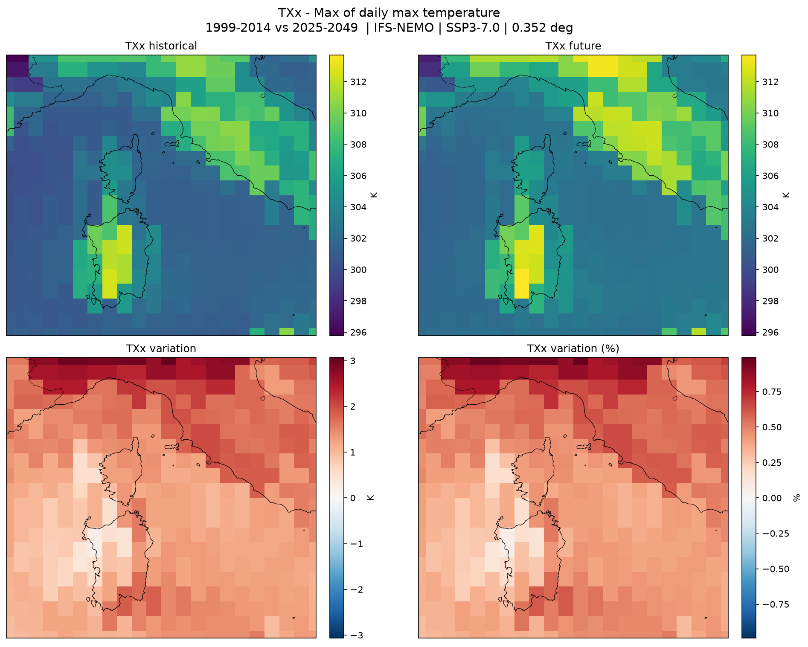

# DeltaTwin Component: Climate Index Plotter

The Climate Index Plotter computes [ETCCDI climate indices](https://etccdi.pacificclimate.org/list_27_indices.shtml)
from the DestinE Climate Change Adaptation Digital Twin (Climate DT) and, for each selected
index, exports a four-panel plot of the projected change between a historical period and a
future projection period over a chosen area:

- top left: the historical index climatology
- top right: the future index climatology, on the same colour scale
- bottom left: absolute variation, `index_future - index_historical`
- bottom right: percentage variation, `(index_future - index_historical) / index_historical * 100`

Climate DT data is streamed lazily from [Earth Data Hub](https://earthdatahub.destine.eu)
(Zarr via `xarray`), so only the area, period, and variables needed are read; nothing is bulk
downloaded. Indices are computed with [xclim](https://xclim.readthedocs.io).



The example above is a real run: TXx (the annual maximum of daily maximum temperature) over
`6,38,14,45` at `standard` resolution, from IFS-NEMO under SSP3-7.0.

## Configuration

The comparison is between two fixed periods, using the same model for both:

- historical period: 1999-2014 (experiment `hist`)
- future projection period: 2025-2049 (experiment `SSP3-7.0`, the Climate DT scenario)

Hourly Climate DT `t2m` and `avg_tprate` are aggregated to the daily inputs the indices
require (`tasmax`, `tasmin`, `tas`, `pr`). Percentile-based indices use day-of-year percentile
thresholds derived from the historical period as their base. Values are plotted in the units
xclim returns, so temperature indices are in kelvin.

### Resolution and pixel size

Climate DT runs natively at 5-10 km on a HEALPix grid. Earth Data Hub publishes it regridded
to two regular latitude/longitude grids, selected with the `resolution` input:

| `resolution` | grid spacing | pixel size at 42 N | relative volume |
| ------------ | ------------ | ------------------ | --------------- |
| `standard` (default) | 0.35 deg | 39 km N-S, 29 km E-W | 1x |
| `high` | 0.044 deg | 4.9 km N-S, 3.6 km E-W | ~65x |

Use `high` when you need the native km-scale detail, and keep the area small. Over the example
Italy box (`7,36,19,47`) `standard` streams about 24 GB and `high` about 240 GB. For reference,
three indices over that box at `standard` resolution takes about 8 minutes; `high` is an order
of magnitude longer. The run logs the volume it is about to stream, and refuses runs above
500 GB.

Because Zarr is read a whole chunk at a time, a very small area is not cheaper than a
moderate one: at `standard` resolution the store's chunks are 64x64 cells, so any box up to
roughly 22 degrees across costs the same as a single chunk column.

### Inputs

| Input | Description |
| ----- | ----------- |
| `edh_api_key` | Earth Data Hub API key from your DESP account settings. Climate DT requires upgraded DESP access. |
| `model` | `IFS-NEMO` (default), `IFS-FESOM` or `ICON`. Applied to both periods. |
| `indices` | Comma-separated ETCCDI ids (e.g. `TXx,FD,Rx1day`), or `all` for all 27. |
| `aoi_bbox` | Area of interest as `west,south,east,north` in degrees. Required unless `aoi_shapefile` is given. |
| `aoi_shapefile` | Path or URL to a shapefile/GeoJSON polygon. Results are masked to it; derives the bbox when `aoi_bbox` is `none`. |
| `resolution` | `standard` (0.35 deg, default) or `high` (0.044 deg). See [Resolution and pixel size](#resolution-and-pixel-size). |

### Outputs

One PNG per selected index, named
`etccdi_<INDEX>_<histperiod>_<futperiod>_<model>_<scenario>.png`
(for example `etccdi_TXx_1999-2014_2025-2049_IFS-NEMO_SSP3-7.0.png`), captured by the output
glob `etccdi_*.png`.

### Supported indices

All 27 core ETCCDI indices, grouped by the daily variable they need:

- daily minimum temperature: FD, TR, TNx, TNn, TN10p, TN90p, CSDI
- daily maximum temperature: SU, ID, TXx, TXn, TX10p, TX90p, WSDI
- daily mean temperature: GSL
- daily min and max temperature: DTR
- daily precipitation: Rx1day, Rx5day, SDII, R10mm, R20mm, Rnnmm, CDD, CWD, R95pTOT, R99pTOT, PRCPTOT

TN10p, TN90p, TX10p, TX90p, WSDI, CSDI, R95pTOT and R99pTOT are percentile-based and use the
historical period as their base.

## Workflow

The workflow is defined in [workflow.yml](workflow.yml) and connects component inputs to the
model and the model output to the component output declared in the manifest.

| Node | Kind | Description |
| ---- | ---- | ----------- |
| edh_api_key | input | Earth Data Hub API key (first CLI argument). |
| model | input | Climate DT model (second CLI argument). |
| indices | input | Selected ETCCDI indices (third CLI argument). |
| aoi_bbox | input | Bounding box (fourth CLI argument). |
| aoi_shapefile | input | Shapefile/GeoJSON path or URL (fifth CLI argument). |
| resolution | input | Grid resolution, `standard` or `high` (sixth CLI argument). |
| climate_index_plotter | model | Streams Climate DT data, computes indices, and exports the plots. |
| plots | output | Output node wired to `outputs.etccdi-plots` (`etccdi_*.png`). |

## Steps to build the component

### Local testing of the model

The model is implemented in
[models/climate_index_plotter/climate_index_plotter.py](models/climate_index_plotter/climate_index_plotter.py)
and accepts positional CLI arguments (`none` is accepted for optional ones):

```shell
python climate_index_plotter.py <edh_api_key> <model> <indices> <aoi_bbox> <aoi_shapefile> <resolution>
```

For example:

```shell
python climate_index_plotter.py "$EDH_API_KEY" IFS-NEMO "TXx,FD,Rx1day" "6,38,14,45" none standard
```

The API key can also be provided through the `EDH_API_KEY` environment variable. The model
writes one `etccdi_*.png` per selected index in its working directory.

Run the unit tests with:

```shell
pip install -r models/climate_index_plotter/requirements.txt pytest
pytest tests/
```

The tests run offline on synthetic data. A single live streaming test runs only when
`EDH_API_KEY` is set.

### Build and run locally with DeltaTwin

Inputs are provided through [inputs.json](inputs.json). Two manifest variants are provided:

- `manifest-local.json`: for local runs (`edh_api_key` is `string`).
- `manifest-remote.json`: for service runs (`edh_api_key` is `secret`).

Before running, copy the desired manifest to `manifest.json`:

```shell
cp manifest-local.json manifest.json
deltatwin run start_local -i inputs.json
```

If this is your first run, DeltaTwin also builds the Docker image and installs model
dependencies.

### Publish to the DeltaTwin service

Before publishing, select the remote manifest:

```shell
cp manifest-remote.json manifest.json
```

If needed, make the component name unique in `manifest.json` (for example by appending your
username), then publish:

```shell
deltatwin component publish -t climate-index-plotter 0.0
```

### Run on the service

After publishing, run from the DeltaTwin UI:

1. Login to https://app.deltatwin.destine.eu
2. Select `DeltaTwins`
3. Open your published `climate-index-plotter` component
4. Click `Run`
5. Fill in `edh_api_key` and `aoi_bbox` (or `aoi_shapefile`)
6. Optionally set `model`, `indices` and `resolution`
7. Start the run

The run produces one `etccdi_*.png` per selected index.

## Notes

- Access to Climate DT data requires upgraded DESP access and an Earth Data Hub API key.
- ETCCDI indices are computed per year and averaged into a climatology for each period; the
  difference between periods is what is plotted.
- Large areas of interest stream more data. Start with a modest bounding box.
