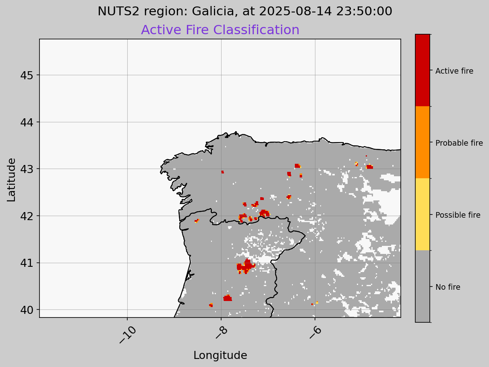

# DeltaTwin Component: Active Fire Monitor

The Active Fire Monitor component downloads MTG FCI Active Fire Level-2 products from the Destination Earth HDA service, extracts fire classification over a selected NUTS2 region, and exports:

- a fire classification plot (`fire_monitor_plot.png`)

## Workflow

The workflow is defined in [workflow.yml](workflow.yml) and connects component inputs to the Fire Monitor model and model outputs to component outputs declared in the manifest.

| **Node** | **Kind** | **Description** |
| -------- | -------- | --------------- |
| user | input | DESP auth username passed to the model as the first CLI argument (`user`). |
| password | input | DESP auth password passed to the model as the second CLI argument (`password`). |
| nuts2_region_name | input | NUTS2 region name passed to the model (third CLI argument). |
| download_date | input | Search end date passed to the model as `YYYY-MM-DD` (fourth CLI argument). |
| fire_monitor | model | Python model that searches FCI Active Fire products, processes classification values, and exports a standard output plot. |
| plot | output | Output node wired to `outputs.fire-monitor-plot` (`fire_monitor_plot.png`). |

## Steps To Build The Component

### Local testing of the model

The model is implemented in [models/fire_monitor/fire_monitor.py](models/fire_monitor/fire_monitor.py) and accepts optional CLI credentials and parameters:

```shell
python models/fire_monitor/fire_monitor.py <username> <password> [<nuts2_region_name> [<date>]]
```

Or, if credentials are already set in environment variables:

```shell
python models/fire_monitor/fire_monitor.py
```

The model writes a deterministic file in its working directory:

- `fire_monitor_plot.png`

An example plot is shown below:



### Build and run locally with DeltaTwin

Inputs are provided through [inputs.json](inputs.json), for example:

```json
{
  "user": {
    "type": "string",
    "value": "johnsmith"
  },
  "password": {
    "type": "string",
    "value": "XXXXXX"
  },
  "nuts2_region_name": {
    "type": "string",
    "value": "Galicia"
  },
  "download_date": {
    "type": "string",
    "value": "2026-04-21"
  }
}
```

Two manifest variants are provided:

- `manifest-local.json`: for local runs (`password` is `string`).
- `manifest-remote.json`: for service runs (`password` is `secret`).

Before running, copy the desired manifest to `manifest.json`:

```shell
cp manifest-local.json manifest.json
deltatwin run start_local -i inputs.json
```

If this is your first run, DeltaTwin also builds the Docker image and installs model dependencies.

### Publish to the DeltaTwin service

Before publishing, select the remote manifest:

```shell
cp manifest-remote.json manifest.json
```

If needed, make the component name unique in `manifest.json` (for example by appending your username), then publish:

```shell
deltatwin component publish -t active-fire -t tutorial 0.0
```

### Run on the service

After publishing, run from the DeltaTwin UI:

1. Login to https://app.deltatwin.destine.eu
2. Select `DeltaTwins`
3. Open your published `fire-monitor` component
4. Click `Run`
5. Fill in `user` and `password`
6. Optionally set `nuts2_region_name` and `download_date`
7. Start the run

The run should produce:

- `fire_monitor_plot.png`
