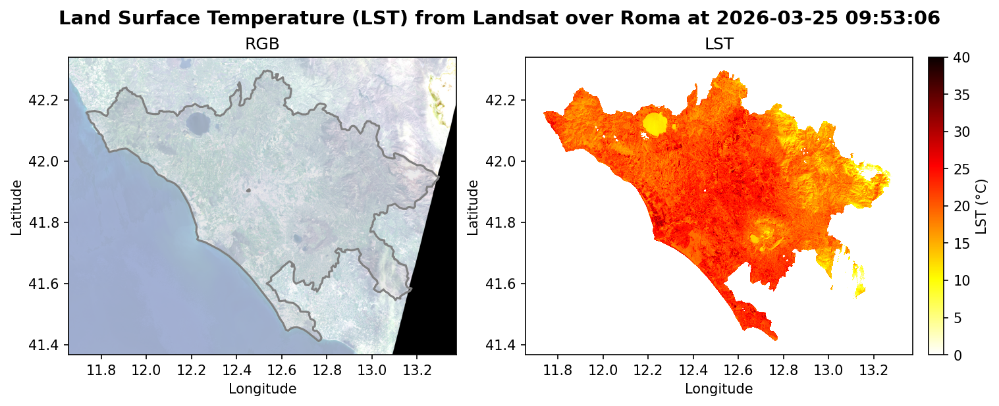

# Urban Heat Island (UHI): LST from Landsat

Computes Land Surface Temperature (LST) over a NUTS3 region from Landsat Collection 2 Level-2 data accessed via the Destination Earth HDA API.

## How it works (`uhi.py`)

1. **Search**: queries the HDA STAC API for Landsat C2 L2 products matching a given date range and NUTS3 bounding box.
2. **Cloud filter**: for each result, downloads only the MTL metadata file first and checks `CLOUD_COVER_LAND`; products exceeding the configured threshold are skipped.
3. **Download**: once an acceptable product is found, the required bands are downloaded: B2 (Blue), B3 (Green), B4 (Red), B10 (TIRS-1 thermal), and QA_PIXEL.
4. **Reproject**: all bands are reprojected to EPSG:4326.
5. **LST calculation**: brightness temperature is derived from B10 using MTL gain/offset coefficients; NDVI (B4/B5 or equivalent) drives an emissivity estimate; LST is computed in °C.
6. **Cloud masking**: pixels flagged in QA_PIXEL (cloud, cloud shadow, dilated cloud) are masked out.
7. **NUTS3 clipping**: the LST raster is clipped to the boundary of the target NUTS3 region fetched from the Eurostat GISCO GeoJSON service.
8. **Save outputs**: LST is written as a GeoTIFF (`<scene>_LST.tif`); a side-by-side RGB + LST PNG plot is also saved (`<scene>_LST_plot.png`).

## Example output

## Notes on bands

- Landsat Level-2 products include atmospheric corrections.
- Collection: `EO.NASA.DAT.LANDSAT.C2_L2`
  - https://sesameo.destine.eu/collections/EO.NASA.DAT.LANDSAT.C2_L2
  - https://data.destination-earth.eu/data-portfolio/EO.NASA.DAT.LANDSAT.C2_L2
- Sentinel-2 does not carry a thermal band (TIRS), so LST from Sentinel-2 alone is not straightforward and is not implemented here.
