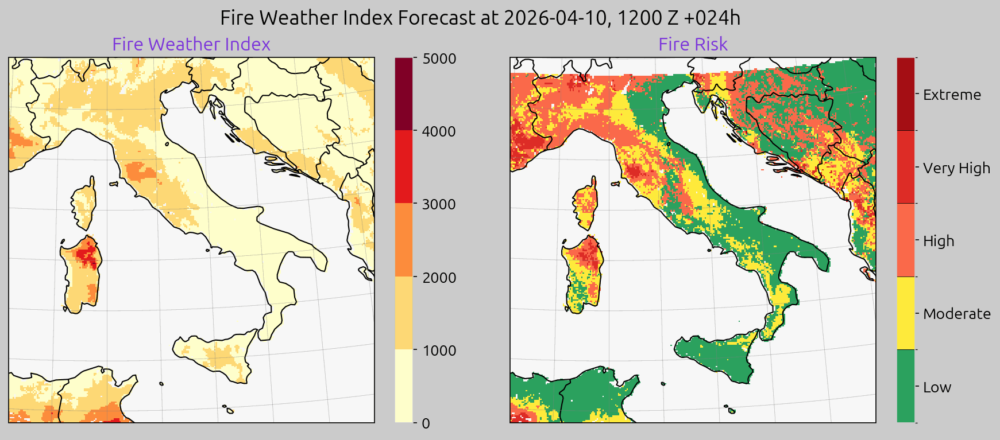
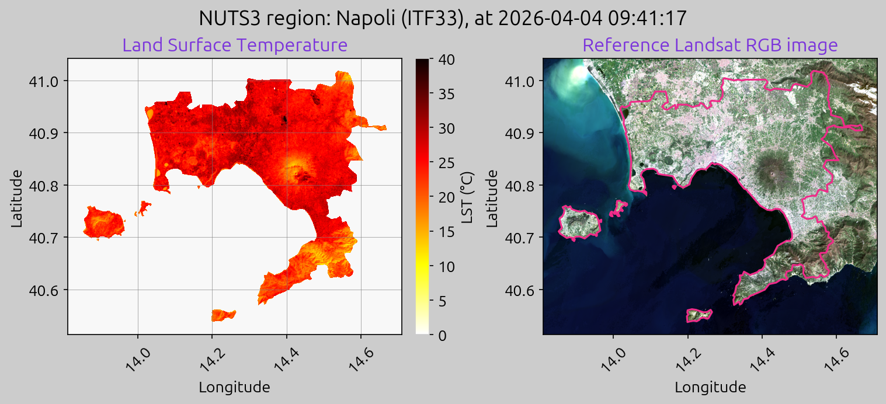

# DestinE Platform Community Use Cases

This repository contains community use cases for the DestinE Service Platform (DESP).

The goal is to provide practical, reproducible examples that show how domain workflows can be packaged as components, executed locally, and published to the platform services.

## Current Use Cases

At the moment, the repository includes two [Delta Twin service](https://deltatwin.destine.eu/) use cases:

- [Fire Risk Plotter](DeltaTwin/FireRiskPlotter/README.md): retrieves short-term fire risk forecast products and generates an animated forecast GIF.
- [LST Plotter](DeltaTwin/LSTPlotter/README.md): downloads Landsat products, computes Land Surface Temperature over a selected area, and exports both raster and plot outputs.

## Example Outputs

### Fire Risk Plotter

### LST Plotter

## Usage

For setup, local execution, publishing, and service-run instructions, refer to the dedicated README of each use case:

- [Fire Risk Plotter](DeltaTwin/FireRiskPlotter/README.md)
- [LST Plotter](DeltaTwin/LSTPlotter/README.md)

## License

This project is licensed under the terms described in the [LICENSE](LICENSE) file.

## Credits

Use cases were developed by David Purnell and Giuseppe Giugliano at Serco.
