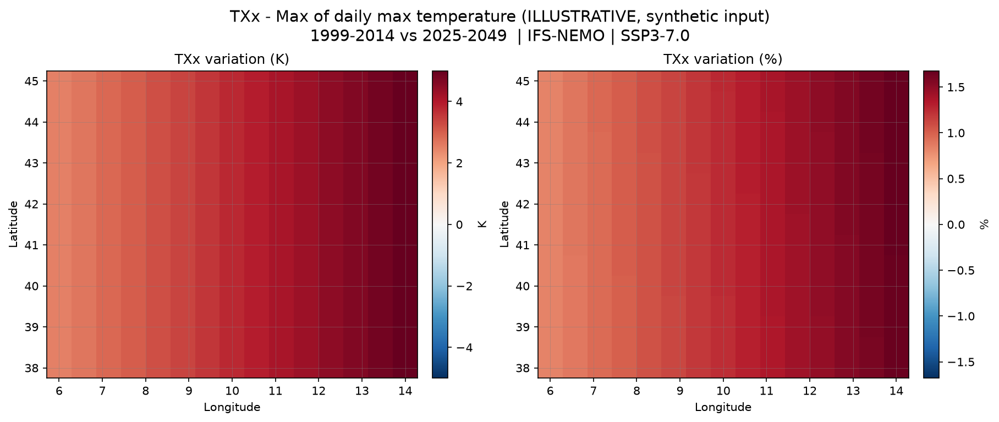

# DestinE Platform Community Use Cases

This repository contains community use cases for the DestinE Service Platform (DESP).

The goal is to provide practical, reproducible examples that show how domain workflows can be packaged as components, executed locally, and published to the platform services.

## Current Use Cases

At the moment, the repository includes four [Delta Twin service](https://deltatwin.destine.eu/) use cases:

- [Fire Monitor](DeltaTwin/FireMonitor/README.md): downloads MTG FCI Active Fire products, extracts fire classification over a selected NUTS2 region, and exports a fire classification plot.
- [Fire Risk Plotter](DeltaTwin/FireRiskPlotter/README.md): retrieves short-term fire risk forecast products and generates an animated forecast GIF.
- [LST Plotter](DeltaTwin/LSTPlotter/README.md): downloads Landsat products, computes Land Surface Temperature over a selected area, and exports both raster and plot outputs.
- [Climate Index Plotter](DeltaTwin/ClimateIndexPlotter/README.md): computes ETCCDI climate indices from the Climate DT (streamed from Earth Data Hub) and plots the projected change between a historical and a future period for each index.

## Example Outputs

### Fire Monitor

### Fire Risk Plotter

### LST Plotter

### Climate Index Plotter

Illustrative two-panel layout (produced from synthetic input; real runs use Climate DT data):

## Usage

For setup, local execution, publishing, and service-run instructions, refer to the dedicated README of each use case:

- [Fire Monitor](DeltaTwin/FireMonitor/README.md)
- [Fire Risk Plotter](DeltaTwin/FireRiskPlotter/README.md)
- [LST Plotter](DeltaTwin/LSTPlotter/README.md)
- [Climate Index Plotter](DeltaTwin/ClimateIndexPlotter/README.md)

## License

This project is licensed under the MIT License. See [LICENSE](LICENSE).

## Credits

Use cases were developed by David Purnell and Giuseppe Giugliano at Serco.
